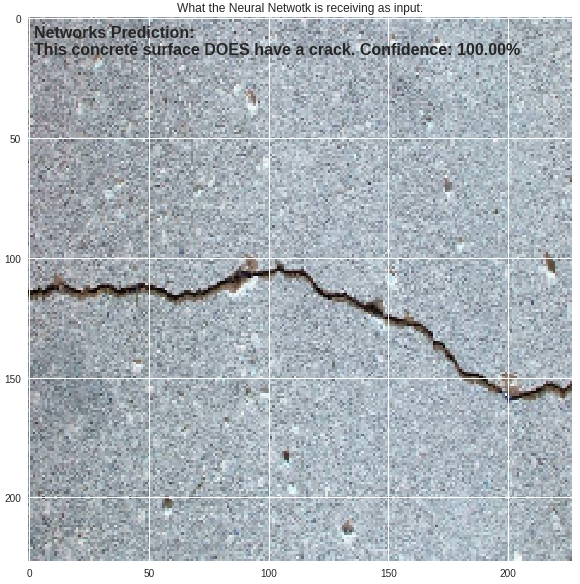

# Concrete Crack Classification with Tensorflow Keras API

The dataset with all the images used in this project was downloaded from Mendeley Data:

Özgenel, Çağlar Fırat (2018), “Concrete Crack Images for Classification”, Mendeley Data, v1
http://dx.doi.org/10.17632/5y9wdsg2zt.1

Dataset: Concrete Crack Images for Classification

File: Concrete Crack Images for Classification

DOI: http://dx.doi.org/10.17632/5y9wdsg2zt.1#file-c0d86f9f-852e-4d00-bf45-9a0e24e3b932

Using the Tensorflow Keras API, a Convolutional Neural Network model was trained on the scaled down images of concrete labeled as "Positive" or "Negative" for concrete surfaces with a crack or not. 

The dataset consists of 40000 concrete surface images split in 20000 labeled "Positive" and 20000 labeled "Negative". The images have been reduced in quality and are actually fragments of much higher quality images.

This repository contains 3 python files. One for the data pre-processing, managing the directories and image sizes, one for the model architecture and training proccess and another one for using an already trained model for predicting one image of your choice. This last one requires a model file that is generated by the second python file.

It uses a Convolutional Neural Network made with Tensorflow Keras API, using GPU for training. It's structured with 3 Convolutional layers, the first with 16 filters and the other two with 32 nodes, each one followed by Max Pooling and Dropout layers. Then, it has a Flatten layer followed by a Fully Connected layer with 64 nodes and finally the Output layer. The activation function used for all layers was ReLU (Rectified Linear Unit), except for the output layer where the Sigmoid function was used.

Since it's a binary classification, the loss function used is binary cross-entropy. The optimizer used is Adam and the adopted batch size 64.

## How to use the files
### Preparing the data - Concrete Crack Classification Data Prep.py
First, you have to run this Python script. Here, the data will be pre-processed. You'll need to have the image files from the dataset separated into two folders, one called "Positive" and the other called "Negative", with the respective image files in each one.
IMPORTANT: There are strings that you'll have to manually change to the directory on your computer.

### Training the model - Concrete Crack Classification Model.py
Here, you will load the data that you prepered with the first script and train the CNN model. The model here is built using tf.Keras. This script will train and save the model in a file that you can load whenever you want (the next script will be doing this). 
IMPORTANT: Here, you'll also have to manually input some directories to save the model and load the data saved previously.

### Predicting with your own images - Concrete Crack Classifier - Trained Model.py
With this script, you will be able to test the model with your own images. The program will handle image dimensions and colors, so you can simply especify the directory and image file name for it to work. The result plot will look something like this:

